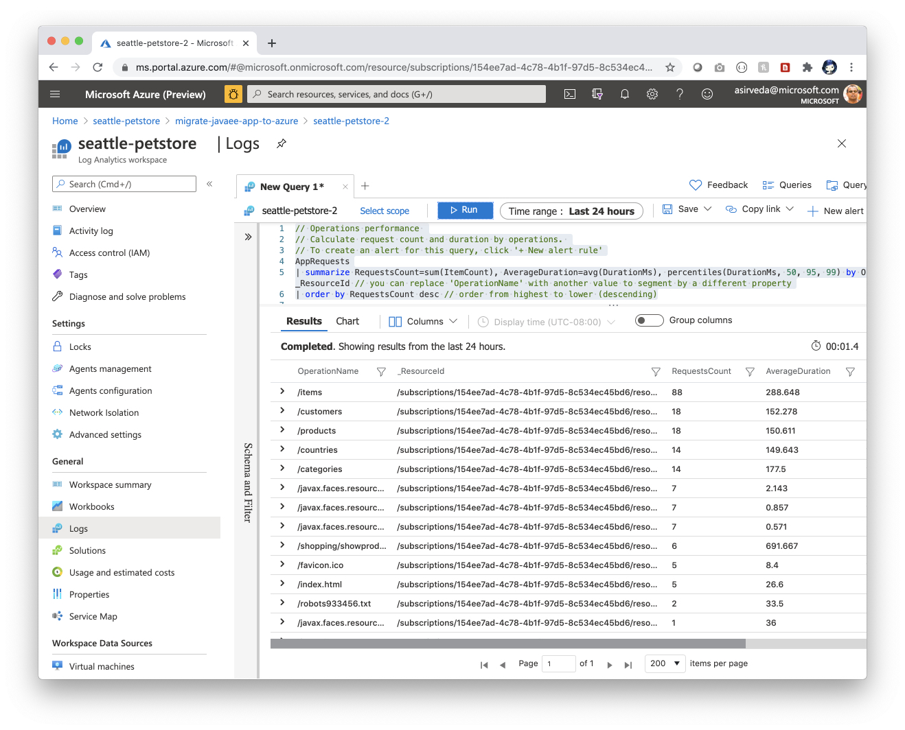
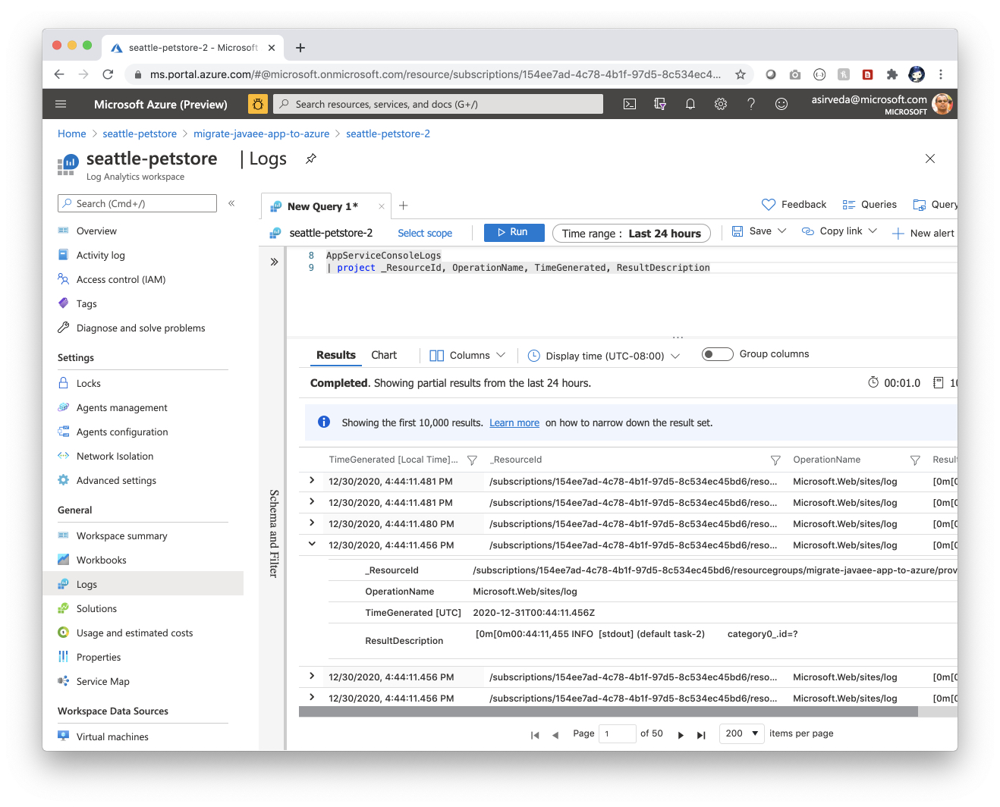
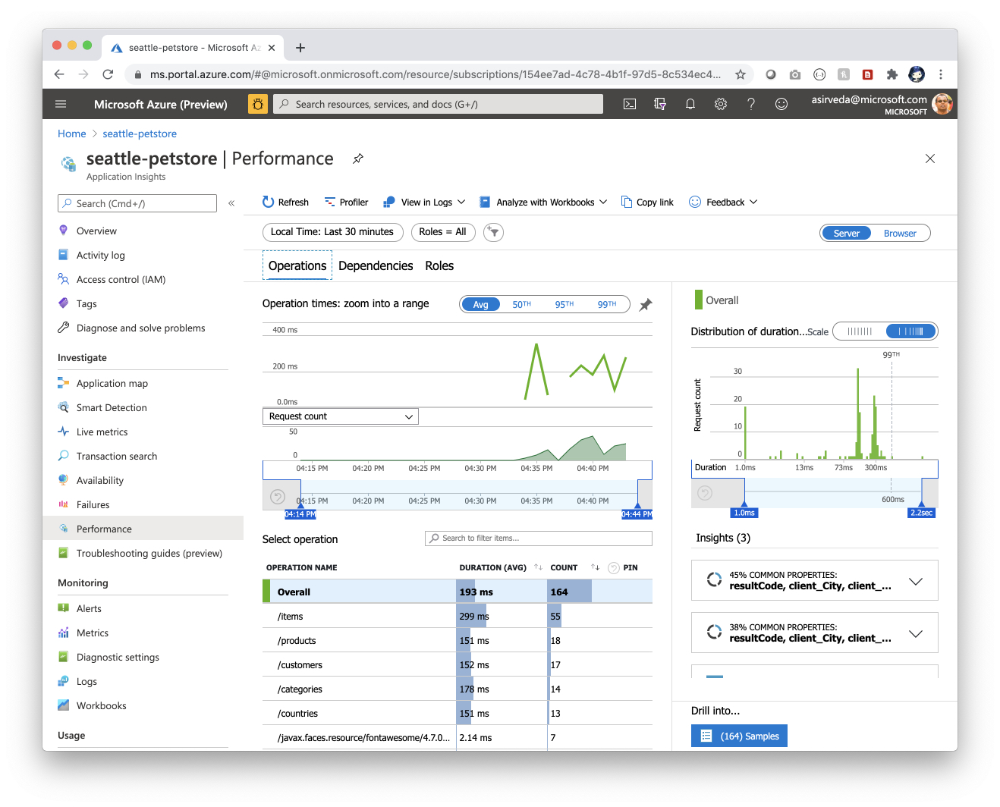
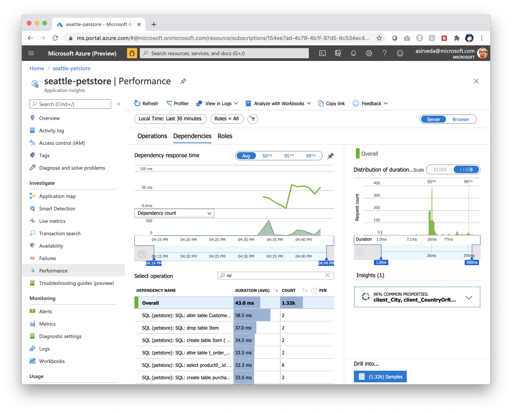
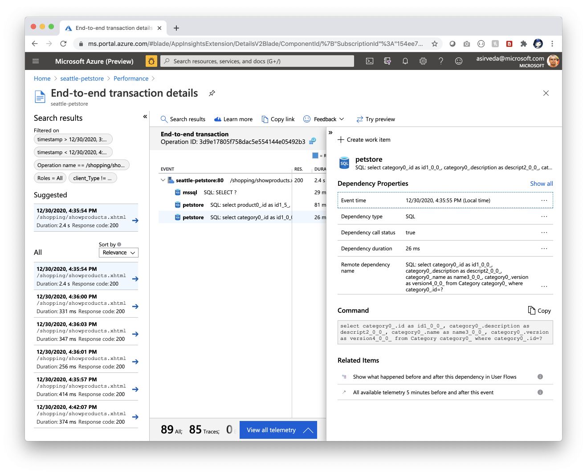
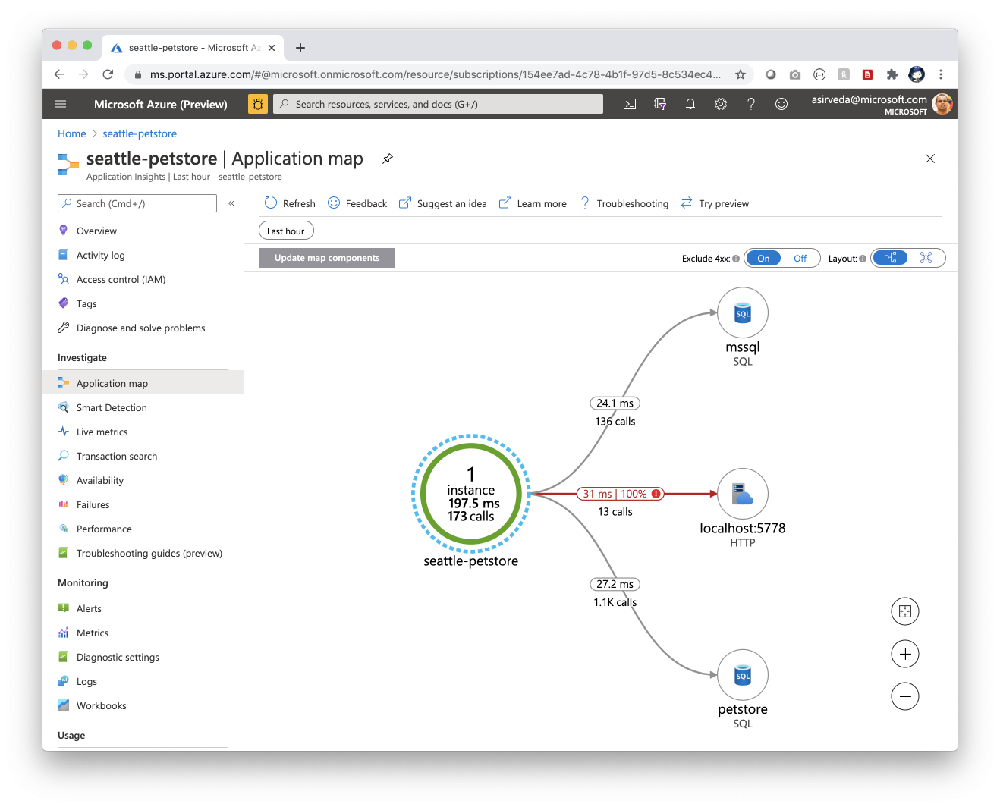
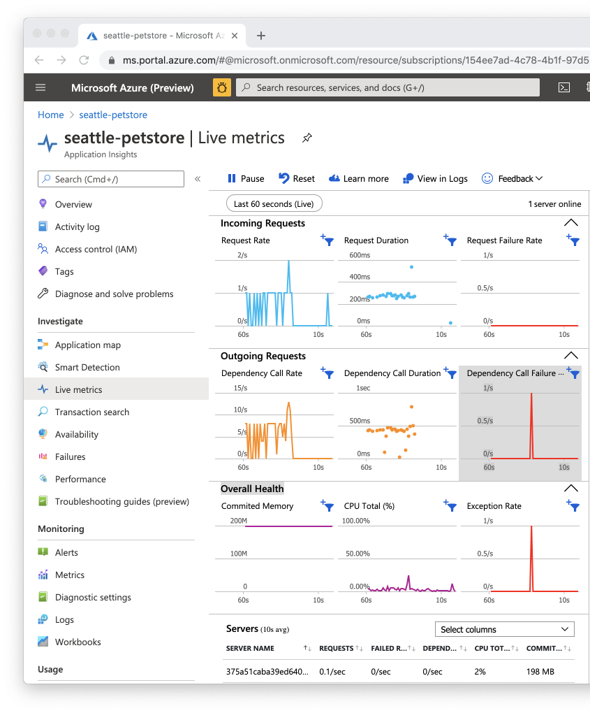

# 04 - Monitor Java EE application

__This guide is part of the [migrate Java EE app to Azure training](../README.md)__

Configure and monitor Java EE application and its dependencies using
Azure Monitor - Log Analytics and Application Insights.

---

## Create and configure Log Analytics Workspace

Create a Log Analytics Workspace using Azure CLI:

```bash
az monitor log-analytics workspace create \
    --workspace-name ${LOG_ANALYTICS} \
    --resource-group ${RESOURCE_GROUP} \
    --location ${REGION}                                       

export LOG_ANALYTICS_RESOURCE_ID=$(az monitor log-analytics workspace show \
    --resource-group ${RESOURCE_GROUP} \
    --workspace-name ${LOG_ANALYTICS} | jq -r '.id')
    
export WEBAPP_RESOURCE_ID=$(az webapp show --name ${WEBAPP} --resource-group ${RESOURCE_GROUP} | jq -r '.id')
```

Setup diagnostics and publish logs and metrics from Java EE application to Azure Monitor:
```bash
az monitor diagnostic-settings create --name "send-logs-and-metrics-to-log-analytics" \
    --resource ${WEBAPP_RESOURCE_ID} \
    --workspace ${LOG_ANALYTICS_RESOURCE_ID} \
    --logs '[
         {
           "category": "AppServiceHTTPLogs",
           "enabled": true,
           "retentionPolicy": {
             "enabled": false,
             "days": 0
           }
         },
         {
            "category": "AppServiceConsoleLogs",
            "enabled": true,
            "retentionPolicy": {
              "enabled": false,
              "days": 0
            }
          },
         {
            "category": "AppServiceAppLogs",
            "enabled": true,
            "retentionPolicy": {
              "enabled": false,
              "days": 0
            }
          },
         {
            "category": "AppServiceFileAuditLogs",
            "enabled": true,
            "retentionPolicy": {
              "enabled": false,
              "days": 0
            }
          },
          {
             "category": "AppServiceAuditLogs",
             "enabled": true,
             "retentionPolicy": {
               "enabled": false,
               "days": 0
             }
           },
          {
             "category": "AppServiceIPSecAuditLogs",
             "enabled": true,
             "retentionPolicy": {
               "enabled": false,
               "days": 0
             }
           },
          {
             "category": "AppServicePlatformLogs",
             "enabled": true,
             "retentionPolicy": {
               "enabled": false,
               "days": 0
             }
           }         
       ]' \
       --metrics '[
         {
           "category": "AllMetrics",
           "enabled": true,
           "retentionPolicy": {
             "enabled": false,
             "days": 0
           }
         }
       ]'
```

## Create and configure Application Insights

Add Azure CLI extension for Application Insights:
```bash
az extension add --name application-insights
```

Create Application Insights using Azure CLI and retrieve the `InstrumentationKey`:
```bash
az monitor app-insights component create --app ${APPLICATION_INSIGHTS} \
    --workspace ${LOG_ANALYTICS_RESOURCE_ID} \
    --location ${REGION} \
    --resource-group ${RESOURCE_GROUP}


export APPLICATIONINSIGHTS_CONNECTION_STRING=InstrumentationKey=$(az monitor \
    app-insights component show --app ${APPLICATION_INSIGHTS} \
    --resource-group ${RESOURCE_GROUP} | jq -r '.instrumentationKey')
```

Download Application Insights Java in-process agent:
```bash
mkdir apm
cd apm
wget https://github.com/microsoft/ApplicationInsights-Java/releases/download/3.0.0/applicationinsights-agent-3.0.0.jar
```

Upload Application Insights Java in-process agent to App Service Linux instance:
```text
ftp
ftp> open waws-prod-bay-139.ftp.azurewebsites.windows.net
Connected to waws-prod-bay-139.drip.azurewebsites.windows.net.
220 Microsoft FTP Service
Name (waws-prod-bay-139.ftp.azurewebsites.windows.net:selvasingh): seattle-petstore\\$seattle-petstore
331 Password required
Password: 
230 User logged in.
ftp> cd site/deployments/tools
250 CWD command successful.
ftp> bin
200 Type set to I.
ftp> put applicationinsights-agent-3.0.0.jar 
200 PORT command successful.
125 Data connection already open; Transfer starting.
226 Transfer complete.
17857000 bytes sent in 9.86 seconds (1.73 Mbytes/s)
ftp> quit
221 Goodbye.
```

Configure the Java EE application to start the Application Insights Java in-process agent:
```bash
az webapp config appsettings set \
    --resource-group ${RESOURCE_GROUP} --name ${WEBAPP} \
    --settings \
    JAVA_OPTS="-javaagent:/home/site/deployments/tools/applicationinsights-agent-3.0.0.jar" \
    APPLICATIONINSIGHTS_CONNECTION_STRING=${APPLICATIONINSIGHTS_CONNECTION_STRING} \
    APPLICATIONINSIGHTS_ROLE_NAME=${WEBAPP}
 
az webapp stop -g ${RESOURCE_GROUP} -n ${WEBAPP}
az webapp start -g ${RESOURCE_GROUP} -n ${WEBAPP}
```

>🚧 - __Preview-specific__. Downloading, installing and engaging the Application Insights Java
in-process agent is only necessary while JBoss EAP on App Service is in preview. Soon, the agent
will be pre-installed and auto-engaged as part of code-less attach feature.

## Use Java EE application and make few REST API calls

Open the Java EE application running on JBoss EAP in App Service Linux:
```bash
open https://${WEBAPP}.azurewebsites.net
```


You can also `curl` the REST API exposed by the Java EE application. The admin REST 
API allows you to create/update/remove items in the catalog, orders or customers. 
You can run the following curl commands:
```bash
curl -X GET https://${WEBAPP}.azurewebsites.net/rest/categories
curl -X GET https://${WEBAPP}.azurewebsites.net/rest/products
curl -X GET https://${WEBAPP}.azurewebsites.net/rest/items
curl -X GET https://${WEBAPP}.azurewebsites.net/rest/countries
curl -X GET https://${WEBAPP}.azurewebsites.net/rest/customers
```

You can also get a JSON representation:
```bash
curl -X GET -H "accept: application/json" https://${WEBAPP}.azurewebsites.net/rest/items
```

Check the Java EE application's Swagger contract:
```bash
curl -X GET https://${WEBAPP}.azurewebsites.net/swagger.json
```

## Monitor Java EE application

Go to Log Analytics and navigate to the `Logs` blade. 
Type and run the following Kusto query to see application performance by operations:
```sql
// Operations performance 
// Calculate request count and duration by operations. 
// To create an alert for this query, click '+ New alert rule'
AppRequests
| summarize RequestsCount=sum(ItemCount), AverageDuration=avg(DurationMs), percentiles(DurationMs, 50, 95, 99) by OperationName, _ResourceId // you can replace 'OperationName' with another value to segment by a different property
| order by RequestsCount desc // order from highest to lower (descending)
```


Type and run the following Kusto query to see application logs:
```sql
AppServiceConsoleLogs
| project _ResourceId, OperationName, TimeGenerated, ResultDescription
```


Go to Application Insights and navigate to the `Performance` blade. You can
see application operation performance:


Click on `Dependencies` to view performance of SQL dependencies:


Click on one of the SQL dependencies and drill into it for end-to-end transaction details:


Click on `Application Map` blade to graphically visualize the call path and dependencies:


Click on `Live Metrics` blade to see metrics and insights with latencies less than 1 second:


---
  
⬅️ Previous guide:  [03 - Bind Java EE application to database](../step-03-bind-java-ee-app-to-database/README.md)

➡️ Next guide: [Step 05 - Set up GitHub Actions](../step-05-setup-github-actions/README.md)
